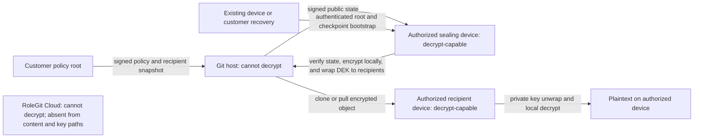
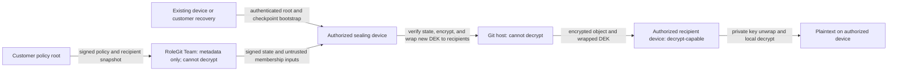
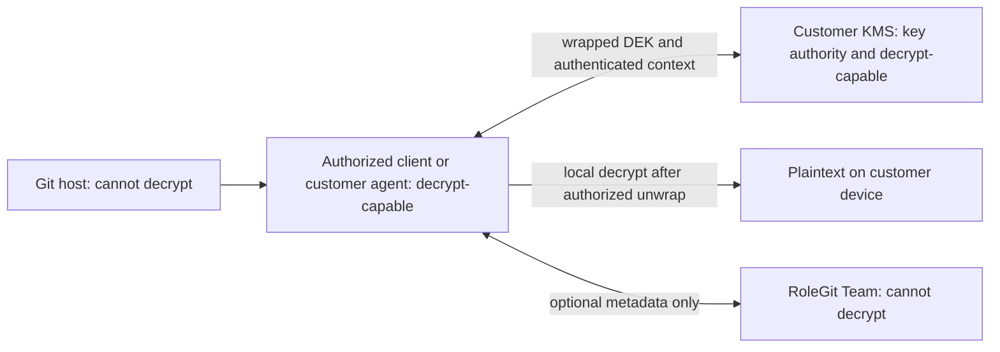
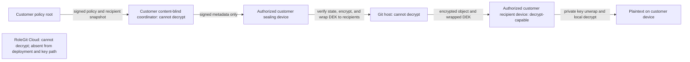
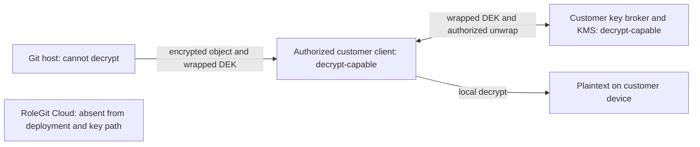
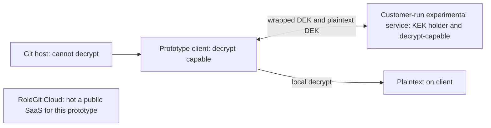

# ADR 0001: Product Modes and Trust Boundaries

- Status: Accepted
- Date: 2026-07-17

## Context

RoleGit is moving from a centralized proof of concept to a local-first product. Across Community,
Team, and Enterprise offerings, a RoleGit-operated service must not receive plaintext or the private
key material needed to decrypt repository content. Enterprise customers may instead choose to place
key authority in infrastructure they control.

This ADR describes the target architecture. The implemented v1 authorization service is classified
separately under [Centralized Prototype](#centralized-prototype).

## Terminology

**Zero-knowledge coordination** means a coordination service does not receive plaintext, plaintext
data-encryption keys (DEKs), role-epoch private material, recovery private keys, or device private
keys. It may still observe documented metadata such as account and repository identifiers, device
public keys, policy digests, signed mutations, timing, and billing or audit events.

This is a product trust-boundary term. It does not claim that RoleGit uses cryptographic
zero-knowledge proofs, and it does not mean the service learns no metadata.

## Decision

Community is the default architecture and performs encryption and decryption on authorized user
devices. Team adds optional metadata-only coordination without entering the key-custody boundary.
Enterprise adds customer-controlled KMS and self-hosted choices. A RoleGit-operated Team service is
never a policy or decryption-key authority and does not receive the material needed to decrypt files;
Community's Git/customer synchronization path and Team's coordinator remain part of their respective
authorization-freshness boundaries until a global transparency and consistency protocol is specified.

| Mode | Key authority | Confidentiality trust boundary | Actors able to decrypt protected files |
| --- | --- | --- | --- |
| Community local-first | A customer-controlled repository policy root authorizes policy-signing keys and recipient snapshots; recipient and recovery private keys unwrap DEKs | Customer policy-signing authority and authorized devices; Git/customer synchronization remains outside key custody but is trusted for signed-state freshness until global consistency is specified | Devices whose recipient or recovery key was authorized when that protected version was sealed, including retained historical versions |
| Team zero-knowledge coordination | The same customer-controlled policy root and recipient private keys as Community; Team membership results are inputs, not authority | Customer policy-signing authority and authorized devices; Team remains outside key custody but is trusted for availability and freshness of signed metadata until transparency is specified | Devices whose recipient or recovery key was authorized when that protected version was sealed; RoleGit Cloud has no decryption key material |
| Enterprise customer KMS | The customer's KMS policy and keys | Authorized clients plus the customer KMS security boundary | Clients currently authorized to unwrap or retaining a previously released DEK; the customer KMS is treated as decrypt-capable because it can unwrap DEKs |
| Enterprise content-blind self-hosted | The customer-controlled policy root and recipient private keys | Customer policy-signing authority and authorized devices; the customer-hosted coordinator has the same freshness limitation as Team | Devices whose recipient or recovery key was authorized when that protected version was sealed, including retained historical versions |
| Enterprise key-broker self-hosted | The customer's self-hosted broker and KMS/KEK | Authorized clients plus the entire customer-operated broker and KMS boundary | Clients currently authorized to unwrap or retaining a previously released DEK, and the customer-controlled key boundary; no RoleGit-operated service |

Specific object schemas, algorithms, signature encodings, and KMS APIs belong in versioned protocol
specifications. They must preserve these boundaries and the following authority rules.

### Policy Authority and Client Verification

The authority is a customer-controlled repository policy-root signing key, not the policy document or
the coordination service. Its public key and an initial signed checkpoint are provisioned to each new
device through an authenticated out-of-band enrollment, an existing authorized device, or a
customer-controlled recovery process. Neither Git nor a coordinator may bootstrap or replace that
root by itself.

The root may authorize bounded policy-signing keys. Customer-signed policy state binds the repository
and vault identifiers, monotonic sequence, previous-state digest, expiration, authorized signing
keys, and recipient-directory digest. Public-key directories and GitHub membership results supplied
by a coordinator are untrusted inputs until covered by that customer-authorized signature chain.

Before sealing, clients must validate the root chain, repository and vault binding, expiration,
sequence, predecessor, and recipient-directory digest. They persist the highest accepted checkpoint
and fail closed on a lower sequence, a different digest at an already observed sequence, or an invalid
predecessor. The validated recipient snapshot exclusively determines which public keys receive the
new DEK.

These checks prevent a distribution service from forging recipients and detect rollback or
equivocation a client has observed, but they do not prove that every client has the globally latest
signed state. A stale or offline sealing device can therefore use a still-valid pre-revocation
snapshot and wrap a new DEK to a revoked recipient.

In Community, a Git split view, stale mirror, or delayed customer synchronization can withhold a
newer signed state and cause that delayed-revocation outcome. Git and the customer-controlled
synchronization path are therefore outside key custody but inside Community's authorization-freshness
boundary. In Team, the coordinator can similarly withhold an update or replay a still-valid state to
an isolated or newly enrolled device. Until a versioned transparency and freshness protocol closes
these gaps, neither mode has a global latest-state guarantee. A Git host or Team service still cannot
decrypt by itself.

### Revocation and Retained History

Recipient snapshots authorize new seals; they do not revoke ciphertext already created. In Community,
Team, and the Enterprise content-blind profile, Git retains each encrypted object and its DEK wrapped
to the recipients authorized at seal time. A removed recipient who retains that private key can later
check out and decrypt an older commit. Publishing a new snapshot or re-sealing the current version
with a fresh DEK excludes the recipient from that new version, subject to the freshness limitation
above, but does not change retained history.

In Enterprise KMS and key-broker modes, and in the centralized prototype, authorization gates DEK
generation or unwrap requests. Credentials, sessions, or tokens expire independently; they do not set
a cryptographic expiry on a generated DEK. Revocation can deny a later unwrap, but cannot recall a DEK
or plaintext already released. Merely re-wrapping or re-encrypting the current version also leaves
older ciphertext and wrapped DEKs in Git. Unlike recipient removal, service-side policy revocation can
deny future unwraps of both current and historical objects, provided the actor did not retain the
released material.

Where historical ciphertext remains decryptable after a policy change, repository-side removal
requires new DEKs, re-encryption, any required recipient or wrapping-key rotation, and removal of old
objects and references from Git history, clones, mirrors, and backups. Even that history rotation
cannot erase DEKs, plaintext, or repository copies an actor already retained. Recipient-mode
revocation is therefore prospective unless that broader rotation is completed within infrastructure
the customer controls; service-mediated revocation remains unable to recall previously released
material.

### Community Local-First

Community requires no RoleGit service for normal protect, seal, unlock, or lock operations. Git stores
ciphertext and public recipient information. Private device and recovery keys stay in local or
customer-controlled custody. Clients authenticate state with the customer policy root, but Git and
the customer's synchronization path remain trusted to deliver fresh, globally consistent state.

Devices authorized for an object's seal can decrypt that object, including from retained history
after their later removal. The Git host and RoleGit Cloud cannot, but a stale or split Git view can
also delay revocation for a future seal as described above.

### Team Zero-Knowledge Coordination

Team may distribute public device directories, signed directory mutations, policy digests, rekey
proposals, transparency data, membership results, and privacy-reviewed audit or billing metadata. Its
APIs must reject plaintext and private or plaintext key material. Membership results and directory
entries cannot authorize a recipient without a customer-authorized signature. Clients continue to
obtain encrypted objects from Git and decrypt locally.

Only a device holding an authorized recipient or recovery private key can directly decrypt. RoleGit
Team, other RoleGit Cloud components, and the Git host receive no decryption key material. Team's
remaining metadata-freshness trust and delayed-revocation risk are defined above rather than hidden by
an unconditional confidentiality claim. Recipient removal is not retroactive for objects retained in
Git history.

### Enterprise Customer KMS

An Enterprise client or customer agent may invoke the customer's KMS directly. RoleGit Cloud may
provide the same optional metadata coordination as Team, but it is not in the key path. KMS policy,
availability, audit, rotation, and revocation are customer responsibilities.

The authorized client can decrypt after KMS authorization. The customer KMS is treated as capable of
decryption because it controls DEK unwrapping. RoleGit Cloud and the Git host cannot decrypt. KMS
revocation can block future unwraps of current and historical objects, but cannot revoke a DEK or
plaintext the client already received. If old ciphertext remains decryptable, repository-side removal
requires the broader rotation described above.

### Enterprise Self-Hosted

Customers may self-host in either of two explicit, mutually exclusive deployment profiles. Neither is
combined with the separate customer-KMS profile above.

#### Content-Blind Coordinator

The service has the Team metadata boundary and the same customer-controlled policy-root,
verification, and freshness rules. Device or recovery private keys remain in client custody, and only
authorized devices can decrypt.

#### Customer Key Broker

The customer-operated service and its KMS/KEK authorize and unwrap DEKs. The broker boundary is
therefore decrypt-capable and must be secured as customer key infrastructure.

In the content-blind profile, devices authorized when an object was sealed can decrypt it even after
later removal, subject also to the documented signed-metadata freshness boundary for future seals. In
the key-broker profile, currently authorized devices, devices retaining a released DEK, and the
customer-controlled broker/KMS boundary are decrypt-capable; broker revocation cannot recall released
material. RoleGit Cloud receives no decryption key material in either profile.

## Centralized Prototype

The current v1 authorization service is an **experimental, self-hosted-only prototype**. It holds a
KEK, unwraps DEKs after its policy check, and returns DEKs to clients. The service is therefore inside
the confidentiality boundary and must be considered capable of decrypting if it obtains ciphertext.
It binds to loopback by default and lacks production deployment controls.

This prototype is not the Community default, not the Team architecture, and not a public RoleGit SaaS
offering. It exists to validate workflow and security assumptions until the local-first format and
recipient model replace or isolate it. It must not be deployed with real secrets.

Both the authorized client and the self-hosted prototype service boundary are decrypt-capable. No
RoleGit-operated Cloud service is part of this prototype deployment. The client stores the generated
DEK wrapped with each encrypted object, and an authorized unwrap recovers the same DEK. Prototype
session expiry prevents a later unwrap request but does not expire a DEK or plaintext already released,
nor does it remove older wrapped DEKs from Git history.

## Consequences

- Community confidentiality does not depend on RoleGit service availability.
- Community depends on Git/customer synchronization for signed-state freshness; stale or split views
  can delay recipient revocation for future seals even though Git has no decryption key material.
- Recipient removal does not revoke historical objects sealed to that recipient; recipient modes
  require re-encryption and history rotation for repository-side retrospective removal, which cannot
  erase retained copies.
- Team can improve coordination but cannot perform server-side plaintext processing or key recovery;
  it remains trusted for signed-metadata freshness until the transparency protocol is specified.
- Enterprise customers that select KMS or key-broker modes intentionally expand the decrypt-capable
  boundary to customer-controlled infrastructure.
- Metadata privacy, retention, global consistency, transparency, and availability require separate
  specifications even when clients enforce the local rollback and fork checks required here.
- Product and protocol documentation must identify the key authority and trust boundary whenever a
  new mode or key path is proposed.
