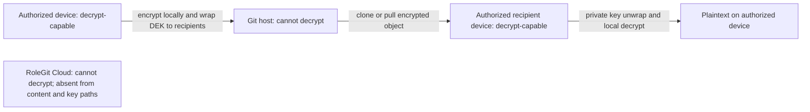
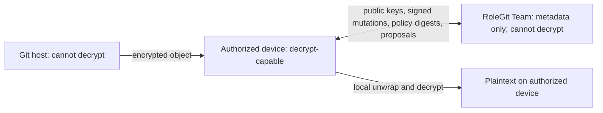
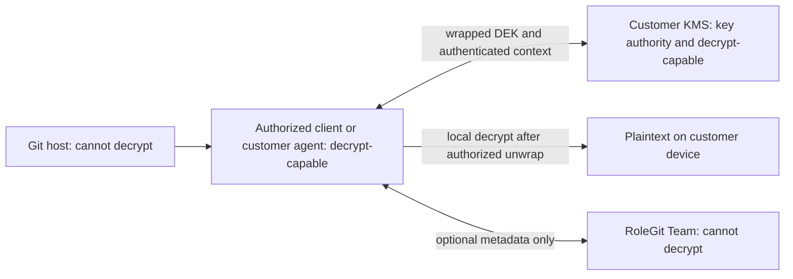
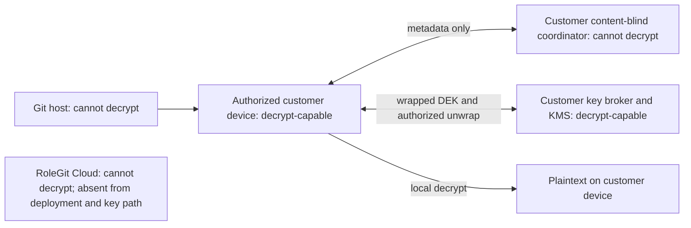
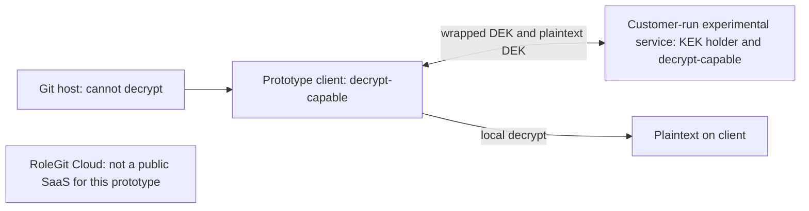

# ADR 0001: Product Modes and Trust Boundaries

- Status: Accepted
- Date: 2026-07-17

## Context

RoleGit is moving from a centralized proof of concept to a local-first product. The product needs one
confidentiality boundary across Community, Team, and Enterprise offerings: encrypted repository
content must not become decryptable by a RoleGit-operated service. Enterprise customers may instead
choose to place key authority in infrastructure they control.

This ADR describes the target architecture. The implemented v1 authorization service is classified
separately under [Centralized Prototype](#centralized-prototype).

## Terminology

**Zero-knowledge coordination** means a coordination service does not receive plaintext, plaintext
data-encryption keys (DEKs), role-epoch private material, recovery private keys, or device private
keys. It may still observe documented metadata such as account and repository identifiers, device
public keys, policy digests, signed mutations, timing, and billing or audit events.

This is a product trust-boundary term. It does not claim that RoleGit uses cryptographic
zero-knowledge proofs, and it does not mean the service learns no metadata.

## Decision

Community is the default architecture and performs encryption and decryption on authorized user
devices. Team adds optional metadata-only coordination without changing that confidentiality
boundary. Enterprise adds customer-controlled KMS and self-hosted choices. A RoleGit-operated Team
service is never a key authority and cannot decrypt protected files.

| Mode | Key authority | Confidentiality trust boundary | Actors able to decrypt protected files |
| --- | --- | --- | --- |
| Community local-first | The signed repository policy plus authorized device and recovery-recipient private keys | Authorized devices; Git hosting and RoleGit services remain outside | Authorized recipient or recovery devices only |
| Team zero-knowledge coordination | The same signed customer policy and private keys as Community | Authorized devices; RoleGit Team is trusted for coordination availability and metadata sequencing, not content confidentiality | Authorized recipient or recovery devices only; RoleGit Cloud cannot decrypt Team files |
| Enterprise customer KMS | The customer's KMS policy and keys | Authorized clients plus the customer KMS security boundary | Authorized clients; the customer KMS is treated as decrypt-capable because it can unwrap DEKs |
| Enterprise content-blind self-hosted | Customer-authorized devices and recovery recipients | Authorized devices; the customer-hosted coordinator is trusted for metadata but not content confidentiality | Authorized recipient or recovery devices only |
| Enterprise key-broker self-hosted | The customer's self-hosted broker and KMS/KEK | Authorized clients plus the entire customer-operated broker and KMS boundary | Authorized clients and the customer-controlled key boundary; no RoleGit-operated service |

Specific object schemas, algorithms, directory signatures, and KMS APIs belong in versioned protocol
specifications. They must preserve these boundaries.

### Community Local-First

Community requires no RoleGit service for normal protect, seal, unlock, or lock operations. Git stores
ciphertext and public recipient information. Private device and recovery keys stay in local or
customer-controlled custody.

The authorized recipient device can decrypt. The Git host and RoleGit Cloud cannot.

### Team Zero-Knowledge Coordination

Team may coordinate public device directories, signed directory mutations, policy digests, rekey
proposals, transparency data, membership results, and privacy-reviewed audit or billing metadata. Its
APIs must reject plaintext and private or plaintext key material. Clients continue to obtain encrypted
objects from Git and decrypt locally.

Only authorized recipient or recovery devices can decrypt. RoleGit Team, other RoleGit Cloud
components, and the Git host cannot decrypt Team files.

### Enterprise Customer KMS

An Enterprise client or customer agent may invoke the customer's KMS directly. RoleGit Cloud may
provide the same optional metadata coordination as Team, but it is not in the key path. KMS policy,
availability, audit, rotation, and revocation are customer responsibilities.

The authorized client can decrypt after KMS authorization. The customer KMS is treated as capable of
decryption because it controls DEK unwrapping. RoleGit Cloud and the Git host cannot decrypt.

### Enterprise Self-Hosted

Customers may self-host in either of two explicit profiles:

- **Content-blind coordinator:** the service has the Team metadata boundary. Device or recovery
  private keys remain the key authority, and only authorized devices can decrypt.
- **Customer key broker:** the customer-operated service and its KMS/KEK authorize and unwrap DEKs.
  The broker boundary is therefore decrypt-capable and must be secured as customer key infrastructure.

In the content-blind profile, only authorized devices can decrypt. In the key-broker profile,
authorized devices and the customer-controlled broker/KMS boundary are decrypt-capable. RoleGit Cloud
cannot decrypt in either profile.

## Centralized Prototype

The current v1 authorization service is an **experimental, self-hosted-only prototype**. It holds a
KEK, unwraps DEKs after its policy check, and returns DEKs to clients. The service is therefore inside
the confidentiality boundary and must be considered capable of decrypting if it obtains ciphertext.
It binds to loopback by default and lacks production deployment controls.

This prototype is not the Community default, not the Team architecture, and not a public RoleGit SaaS
offering. It exists to validate workflow and security assumptions until the local-first format and
recipient model replace or isolate it. It must not be deployed with real secrets.

Both the authorized client and the self-hosted prototype service boundary are decrypt-capable. No
RoleGit-operated Cloud service is part of this prototype deployment.

## Consequences

- Community confidentiality does not depend on RoleGit service availability.
- Team can improve coordination but cannot perform server-side plaintext processing or key recovery.
- Enterprise customers that select KMS or key-broker modes intentionally expand the decrypt-capable
  boundary to customer-controlled infrastructure.
- Metadata privacy, retention, replay protection, transparency, and availability require separate
  specifications even when the service is content-blind.
- Product and protocol documentation must identify the key authority and trust boundary whenever a
  new mode or key path is proposed.
