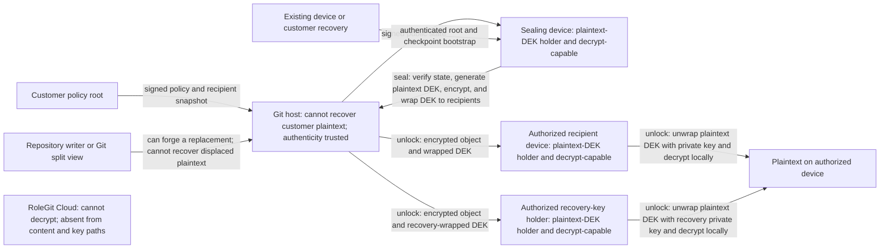
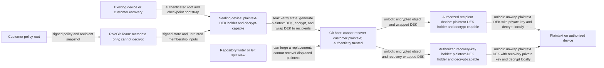
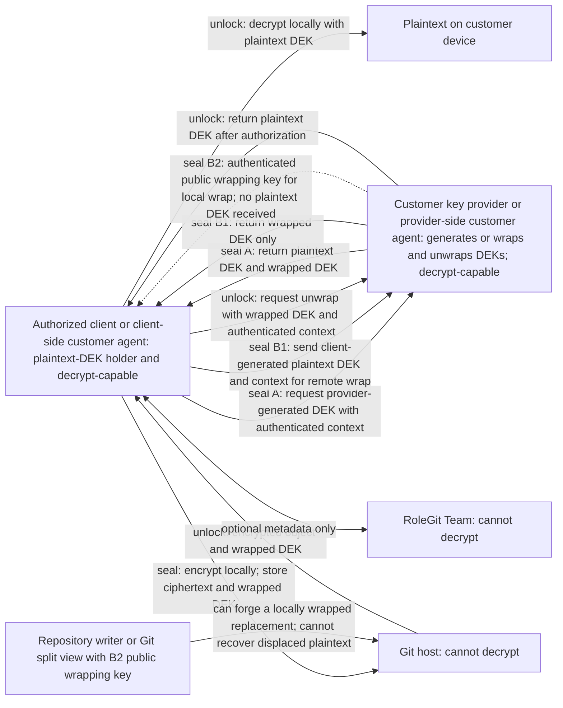
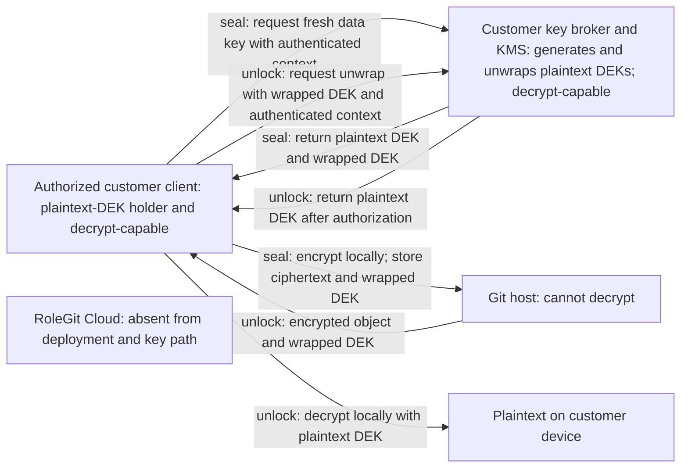
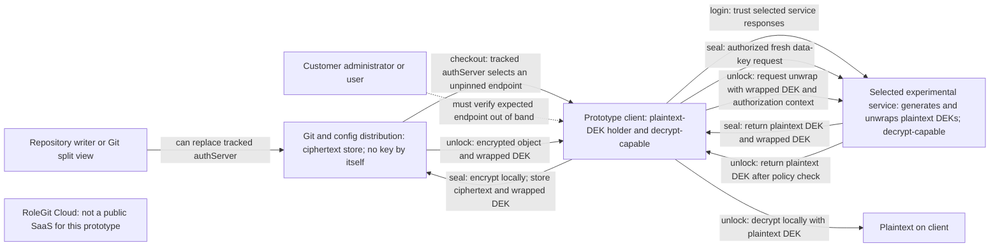

# ADR 0001: Product Modes and Trust Boundaries

- Status: Accepted
- Date: 2026-07-17

## Context

RoleGit is moving from a centralized proof of concept to a local-first product. Across Community,
Team, and Enterprise offerings, a RoleGit-operated service must not receive plaintext or the private
key material needed to decrypt repository content. Enterprise customers may instead choose to place
key authority in key-provider infrastructure they control.

This ADR describes the target architecture. The implemented v1 authorization service is classified
separately under [Centralized Prototype](#centralized-prototype).

## Terminology

**Zero-knowledge coordination** means a coordination service does not receive plaintext, plaintext
data-encryption keys (DEKs), role-epoch private material, recovery private keys, or device private
keys. It may still observe documented metadata such as account and repository identifiers, device
public keys, policy digests, signed mutations, timing, and billing or audit events.

This is a product trust-boundary term. It does not claim that RoleGit uses cryptographic
zero-knowledge proofs, and it does not mean the service learns no metadata.

## Decision

Community is the default architecture and performs encryption and decryption on authorized user
devices. Team adds optional metadata-only coordination without entering the key-custody boundary.
Enterprise adds customer-controlled key-provider and self-hosted choices. A RoleGit-operated Team
service is never a policy or decryption-key authority and does not receive the material needed to
decrypt files; Community's Git/customer synchronization path and Team's coordinator remain part of
their respective authorization-freshness boundaries until a global transparency and consistency
protocol is specified. Recipient-mode and Enterprise local-wrap content authenticity also remains in
the repository write and Git provenance boundary until a sealer-authentication protocol is specified.

| Mode | Key authority | Confidentiality trust boundary | Actors able to decrypt protected files |
| --- | --- | --- | --- |
| Community local-first | A customer-controlled repository policy root authorizes policy-signing keys and recipient snapshots; recipient and recovery private keys unwrap DEKs | Customer policy-signing authority and authorized devices; Git/customer synchronization remains outside key custody but is trusted for signed-state freshness until global consistency is specified | Devices whose recipient or recovery key was authorized when that protected version was sealed, and sealing devices that generated or otherwise obtained and retained its plaintext DEK |
| Team zero-knowledge coordination | The same customer-controlled policy root and recipient private keys as Community; Team membership results are inputs, not authority | Customer policy-signing authority and authorized devices; Team remains outside key custody but is trusted for availability and freshness of signed metadata until transparency is specified | Devices whose recipient or recovery key was authorized when that protected version was sealed, and sealing devices that generated or otherwise obtained and retained its plaintext DEK; RoleGit Cloud has no decryption key material |
| Enterprise customer key provider | The customer's provider policy and wrapping/unwrap keys; provider policy authorizes requests it receives, while possession of a B2 public wrapping key permits local sealing but does not authorize the sealer or content | Authorized clients and client-side agents plus the customer-controlled provider/provider-side-agent security boundary | Clients and client-side agents currently authorized to unwrap or that generated or otherwise obtained and retained a DEK; the provider-side boundary is treated as decrypt-capable because it controls unwrap |
| Enterprise content-blind self-hosted | The customer-controlled policy root and recipient private keys | Customer policy-signing authority and authorized devices; the customer-hosted coordinator has the same freshness limitation as Team | Devices whose recipient or recovery key was authorized when that protected version was sealed, and sealing devices that generated or otherwise obtained and retained its plaintext DEK |
| Enterprise key-broker self-hosted | The customer's self-hosted broker and KMS/KEK | Authorized clients plus the entire customer-operated broker and KMS boundary | Clients currently authorized to unwrap or retaining a previously released DEK, and the customer-controlled key boundary; no RoleGit-operated service |

Specific object schemas, algorithms, signature encodings, and key-provider APIs belong in versioned protocol
specifications. They must preserve these boundaries and the following authority rules.

### Policy Authority and Client Verification

The authority is a customer-controlled repository policy-root signing key, not the policy document or
the coordination service. Its public key and an initial signed checkpoint are provisioned to each new
device through an authenticated out-of-band enrollment, an existing authorized device, or a
customer-controlled recovery process. Neither Git nor a coordinator may bootstrap or replace that
root by itself.

The root may authorize bounded policy-signing keys. Customer-signed policy state binds the repository
and vault identifiers, monotonic sequence, previous-state digest, expiration, authorized signing
keys, and recipient-directory digest. Public-key directories and GitHub membership results supplied
by a coordinator are untrusted inputs until covered by that customer-authorized signature chain.

Before sealing, clients must validate the root chain, repository and vault binding, expiration,
sequence, predecessor, and recipient-directory digest. They persist the highest accepted checkpoint
and fail closed on a lower sequence, a different digest at an already observed sequence, or an invalid
predecessor. The validated recipient snapshot exclusively determines which public keys receive the
new DEK.

These checks prevent a distribution service from forging recipients and detect rollback or
equivocation a client has observed, but they do not prove that every client has the globally latest
signed state. A stale or offline sealing device can therefore use a still-valid pre-revocation
snapshot and wrap a new DEK to a revoked recipient.

In Community, a Git split view, stale mirror, or delayed customer synchronization can withhold a
newer signed state and cause that delayed-revocation outcome. Git and the customer-controlled
synchronization path are therefore outside key custody but inside Community's authorization-freshness
boundary. In Team, the coordinator can similarly withhold an update or replay a still-valid state to
an isolated or newly enrolled device. Until a versioned transparency and freshness protocol closes
these gaps, neither mode has a global latest-state guarantee. A Git host or Team service still cannot
decrypt by itself.

### Content Authenticity and Sealer Authority

The policy root authorizes recipient state; it does not currently authorize sealing identities, and
the target recipient format does not yet specify a sealer signature that recipients verify. Likewise,
authenticating an Enterprise B2 provider public wrapping key proves which provider can unwrap a DEK;
it does not authenticate the actor that sealed the object, and a public key is not a sealing-authorization
secret. AEAD authentication detects modification of an object without its DEK, but it does not prove
who created a new, internally valid object. A repository writer or Git host presenting a split view can
choose a new DEK, encrypt attacker-chosen plaintext, wrap that DEK to valid recipients from a signed
snapshot or locally with an obtained B2 public wrapping key and the bound repository/path context, and
substitute the resulting decryptable object. That actor still cannot recover the displaced customer
plaintext, but can forge replacement content that an authorized client can submit for unwrap.

Community, Team, Enterprise content-blind recipients, and Enterprise B2 local-wrap recipients therefore
trust repository write controls, review, and Git provenance for content authenticity. "Sealing device"
in this ADR identifies an actor that performs sealing and may retain its DEK; it does not mean the
customer policy cryptographically authorized that actor. A future versioned format may move this
boundary by defining sealer keys, policy authorization, object signatures, and mandatory recipient
verification. A future B2 provider contract could instead require authenticated sealer authorization
and object registration that is enforced at unwrap. Until one of those contracts is specified, the
diagrams show the trusted write path explicitly and neither recipient modes nor B2 local wrap may claim
cryptographically authenticated sealer provenance.

### Revocation and Retained History

Recipient snapshots authorize new seals; they do not revoke ciphertext already created. In Community,
Team, and the Enterprise content-blind profile, Git retains each encrypted object and its DEK wrapped
to the recipients authorized at seal time. A removed recipient who retains that private key can later
check out and decrypt an older commit. A sealing device can also decrypt any version whose
plaintext DEK it generated or otherwise obtained and retained, independently of whether it holds a
recipient or recovery private key. Publishing a new snapshot or re-sealing the current version with a
fresh DEK excludes the recipient from that new version, subject to the freshness limitation above,
but does not revoke a DEK retained by its sealer or change retained history.

In Enterprise key-provider and key-broker modes, and in the centralized prototype, authorization gates
DEK generation, wrap, or unwrap requests that reach the provider. Credentials, sessions, or tokens expire
independently; they do not set a cryptographic expiry on a generated DEK. Revocation can deny a later
unwrap, but cannot recall a DEK or plaintext already generated or obtained by a client. B2 local wrap
makes no provider request while sealing, so provider revocation cannot affect a client-generated DEK
while the client or client-side agent holds or retains it; provider policy controls only a later unwrap.
Merely re-wrapping or re-encrypting the current version also leaves older ciphertext and wrapped DEKs
in Git. Unlike
recipient removal, service-side policy revocation can deny future unwraps of both current and
historical objects, provided the actor did not generate or otherwise obtain and retain the material.

Where historical ciphertext remains decryptable after a policy change, repository-side removal
requires new DEKs, re-encryption, any required recipient or wrapping-key rotation, and removal of old
objects and references from Git history, clones, mirrors, and backups. Even that history rotation
cannot erase DEKs, plaintext, or repository copies an actor already retained. Recipient-mode
revocation is therefore prospective unless that broader rotation is completed within infrastructure
the customer controls; service-mediated revocation remains unable to recall previously generated or
obtained material.

### Community Local-First

Community requires no RoleGit service for normal protect, seal, unlock, or lock operations. Git stores
ciphertext and public recipient information. Private device and recovery keys stay in local or
customer-controlled custody. Clients authenticate state with the customer policy root, but Git and
the customer's synchronization path remain trusted to deliver fresh, globally consistent state.

Authorized recipient and recovery-key devices can decrypt objects sealed to their keys, including
from retained history after their later removal. A sealing device can also decrypt an
object when it generated or otherwise obtained and retained the plaintext DEK. The Git host and
RoleGit Cloud cannot recover customer plaintext, but repository writers and split Git views can forge
replacement content under the authenticity boundary described above. A stale or split Git view can
also delay revocation for a future seal.

### Team Zero-Knowledge Coordination

Team may distribute public device directories, signed directory mutations, policy digests, rekey
proposals, transparency data, membership results, and privacy-reviewed audit or billing metadata. Its
APIs must reject plaintext and private or plaintext key material. Membership results and directory
entries cannot authorize a recipient without a customer-authorized signature. Clients continue to
obtain encrypted objects from Git and decrypt locally.

A device holding an authorized recipient or recovery private key can directly decrypt, as can a
sealing device that generated or otherwise obtained and retained the plaintext DEK.
RoleGit Team, other RoleGit Cloud components, and the Git host receive no decryption key material.
Team's remaining metadata-freshness trust and delayed-revocation risk are defined above rather than
hidden by an unconditional confidentiality claim. Recipient removal is not retroactive for objects
retained in Git history and cannot recall a DEK retained by a sealing device. Content authenticity
still depends on the repository write and Git provenance boundary; Team metadata coordination does
not authenticate a sealer.

### Enterprise Customer Key Provider

An Enterprise client or client-side customer agent may invoke the customer's key provider, such as a
KMS, HSM, or Vault deployment, directly or through a provider-side customer agent. A client-side agent
runs in the authorized client boundary and may handle plaintext DEKs; a provider-side agent runs
inside the customer provider security boundary and is trusted like the provider. RoleGit Cloud may
provide the same optional metadata coordination as Team, but it is not in the key path. Provider
policy, availability, audit, rotation, and revocation are customer responsibilities. The provider
contract requires wrap and unwrap without assuming a provider-specific data-key-generation API. When
supported, a provider-generated sealing variant requests a fresh DEK and receives its plaintext and
wrapped forms. A client-generated-plus-wrap variant creates the DEK only in the client or client-side
agent and produces a wrapped form for persistence: remote wrap sends that plaintext DEK into the
provider/provider-side-agent boundary and returns the wrapped form, while local wrapping in the client
boundary with an authenticated provider public key sends no plaintext DEK into the provider boundary
during sealing.

In every variant, the client or client-side agent encrypts locally and persists only the ciphertext
and wrapped DEK. For unlock, the provider authorizes the wrapped DEK and authenticated context before
the provider or its provider-side agent returns the plaintext DEK to the client boundary.

The authorized client or client-side agent can decrypt whenever it holds the plaintext DEK. In the B2
local-wrap variant, it can decrypt immediately after generating the DEK without an unwrap authorization;
other unlocks require provider authorization. That unwrap authorization does not establish who sealed
the object: absent authenticated sealer authorization and provider-enforced object registration, a
repository writer that obtains the public wrapping key can construct a replacement that reaches unwrap.
Provider-generated and remote-wrap sealing place plaintext DEKs inside the provider/provider-side-agent
boundary; client-side local public-key wrapping does not do so during sealing. The provider-side
boundary is nevertheless always treated as decrypt-capable because it controls unwrap. RoleGit Cloud
and the Git host cannot decrypt. Provider revocation can block future unwraps of current and historical
objects, but cannot revoke a DEK or plaintext the client already received. If old ciphertext remains
decryptable, repository-side removal requires the broader rotation described above.

### Enterprise Self-Hosted

Customers may self-host in either of two explicit, mutually exclusive deployment profiles. Neither is
combined with the separate customer-KMS profile above.

#### Content-Blind Coordinator

The service has the Team metadata boundary and the same customer-controlled policy-root,
verification, and freshness rules. Device or recovery private keys remain in client custody. Devices
holding those keys, and sealing devices while they hold or retain a plaintext DEK, can decrypt.

```mermaid
flowchart LR
    R[Customer policy root] -->|signed policy and recipient snapshot| C[Customer content-blind coordinator: cannot decrypt]
    C -->|signed metadata only| S[Customer sealing device: plaintext-DEK holder and decrypt-capable]
    S -->|seal: verify state, generate plaintext DEK, encrypt, and wrap DEK to recipients| G[Git host: cannot recover customer plaintext; authenticity trusted]
    W[Repository writer or Git split view] -->|can forge a replacement; cannot recover displaced plaintext| G
    G -->|unlock: encrypted object and wrapped DEK| D[Authorized customer recipient device: plaintext-DEK holder and decrypt-capable]
    D -->|unlock: unwrap plaintext DEK with private key and decrypt locally| P[Plaintext on customer device]
    G -->|unlock: encrypted object and recovery-wrapped DEK| H[Authorized recovery-key holder: plaintext-DEK holder and decrypt-capable]
    H -->|unlock: unwrap plaintext DEK with recovery private key and decrypt locally| P
    L[RoleGit Cloud: cannot decrypt; absent from deployment and key path]
```

#### Customer Key Broker

The customer-operated service and its KMS/KEK generate and unwrap DEKs. For sealing, that boundary
returns a fresh plaintext DEK and its wrapped form to the client; for unlock, it returns the plaintext
DEK only after authorizing the wrapped DEK and context. The broker boundary is therefore
decrypt-capable and must be secured as customer key infrastructure.

In the content-blind profile, recipient and recovery-key devices authorized when an object was sealed
can decrypt it even after later removal, subject also to the documented signed-metadata freshness
boundary for future seals. A sealing device can independently decrypt when it generated
or otherwise obtained and retained the plaintext DEK, which recipient removal cannot recall. In the
key-broker profile, currently authorized devices, devices retaining a released DEK, and the
customer-controlled broker/KMS boundary are decrypt-capable; broker revocation cannot recall released
material. RoleGit Cloud receives no decryption key material in either profile. The content-blind
profile has the same repository write and Git provenance authenticity boundary as Community and Team.

## Centralized Prototype

The current v1 authorization service is an **experimental, self-hosted-only prototype**. It holds a
KEK, unwraps DEKs after its policy check, and returns DEKs to clients. The service is therefore inside
the confidentiality boundary and must be considered capable of decrypting if it obtains ciphertext.
It binds to loopback by default and lacks production deployment controls.

The service's identity is not pinned independently of Git. The client reads `authServer` from tracked
`.enclist`, accepts any HTTPS origin (or loopback HTTP), and uses that endpoint for login, DEK
generation, and unwrap. A repository writer or Git host presenting a split view can therefore redirect
a fresh checkout or a subsequent login after the old local session is inactive. GitHub authentication
establishes the user's identity to the selected service; it does not authenticate that service as the
customer's intended deployment. The selected endpoint can return valid-shaped login and key responses
without proving possession of a customer-pinned service identity.

The legitimate server policy is therefore not the sole authority for future seals. Tracked endpoint
distribution and the user's manual verification select which server policy and key boundary the client
trusts. A replacement service can choose a DEK and wrapped key for `seal`, then decrypt or forge that
version if it obtains the ciphertext from Git. Redirected `unlock` requests disclose the vault, path,
and wrapped key and can deny availability, but endpoint replacement alone does not reveal objects
previously sealed through the expected service: the replacement cannot unwrap their DEKs, and an
incorrect key fails authenticated decryption. An active machine-local server/session association or
materialization lease blocks transparent replacement, and `lock` remembers previously used servers;
these properties protect continuity and cleanup, not fresh-checkout or later-login bootstrap.

Until this path is removed or service identity is pinned, administrators must distribute the expected
canonical endpoint through an authenticated channel outside Git, and users must verify the exact
`.enclist.authServer` value before every prototype login. An endpoint change requires explicit
administrator/user verification. Implementation is tracked in
[issue #55](https://github.com/cosentinode/rolegit/issues/55).

This prototype is not the Community default, not the Team architecture, and not a public RoleGit SaaS
offering. It exists to validate workflow and security assumptions until the local-first format and
recipient model replace or isolate it. It must not be deployed with real secrets.

Both the authorized client and the self-hosted prototype service boundary are decrypt-capable. No
RoleGit-operated Cloud service is part of this prototype deployment. The client stores the generated
DEK wrapped with each encrypted object, and an authorized unwrap recovers the same DEK. Prototype
session expiry prevents a later unwrap request but does not expire a DEK or plaintext already released,
nor does it remove older wrapped DEKs from Git history. Git remains outside direct key custody only as
a passive store; a repository writer or split-view Git host can redirect configuration to a colluding
service and thereby compromise confidentiality and authenticity of future seals.

## Consequences

- Community confidentiality does not depend on RoleGit service availability.
- Community depends on Git/customer synchronization for signed-state freshness; stale or split views
  can delay recipient revocation for future seals even though Git has no decryption key material.
- Recipient removal does not revoke historical objects sealed to that recipient; recipient modes
  require re-encryption and history rotation for repository-side retrospective removal, which cannot
  erase retained copies.
- Team can improve coordination but cannot perform server-side plaintext processing or key recovery;
  it remains trusted for signed-metadata freshness until the transparency protocol is specified.
- Recipient-mode policy authorizes recipients, not sealers, and a B2 public wrapping key authenticates
  the unwrap provider, not the sealer; without specified sealer authentication, recipients trust
  repository write controls and Git provenance against forged replacement content.
- Enterprise customers that select key-provider or key-broker modes intentionally expand the decrypt-capable
  boundary to customer-controlled infrastructure.
- The centralized prototype's tracked service endpoint is inside its bootstrap and confidentiality
  boundary: repository writers can redirect future login and key operations unless users verify the
  endpoint out of band, and HTTPS plus active-session continuity does not pin customer service identity.
- Metadata privacy, retention, global consistency, transparency, and availability require separate
  specifications even when clients enforce the local rollback and fork checks required here.
- Product and protocol documentation must identify the key authority and trust boundary whenever a
  new mode or key path is proposed.
